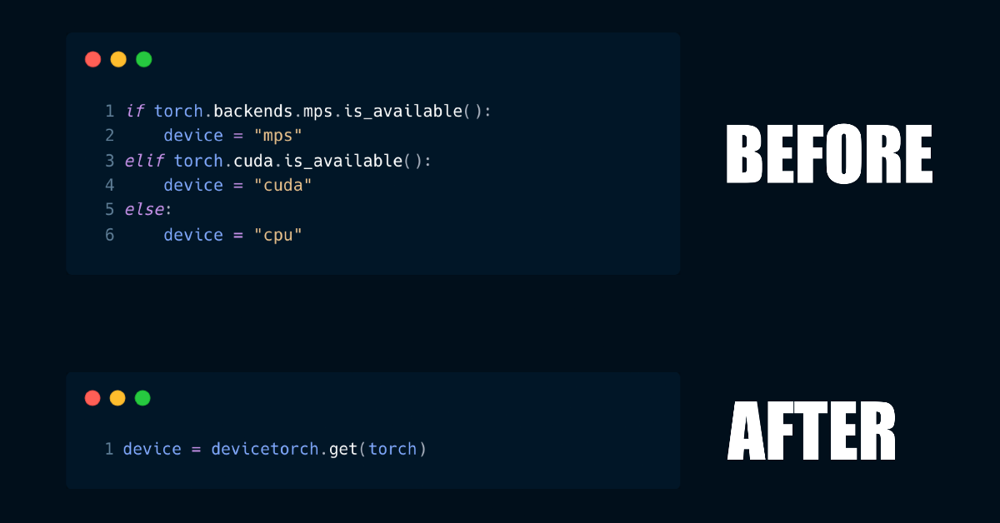

# devicetorch



get torch device in one line

# Install

```
pip install devicetorch
```

and import:

```
import devicetorch
```

# API

## get

get the torch device.

```
device = devicetorch.get(torch)    # pass in the existing torch object
```

Equivalent to:

```
if torch.backends.mps.is_available():
  device = "mps"
elif torch.cuda.is_available():
  device = "cuda"
else:
  device = "cpu"
```

## empty_cache

empty cache for the device.

```
devicetorch.empty_cache(torch)
```

Equivalent to:

```
if torch.backends.mps.is_available():
  torch.mps.empty_cache()
elif torch.cuda.is_available():
  torch.cuda.empty_cache()
```

## to

run `.to(device)` automatically for the current device

```
pipe = CosStableDiffusionXLInstructPix2PixPipeline.from_single_file(edit_file, num_in_channels=8)
devicetorch.to(torch, pipe)
```

Equivalent to:

```
pipe = CosStableDiffusionXLInstructPix2PixPipeline.from_single_file(edit_file, num_in_channels=8)
if torch.backends.mps.is_available():
  pipe.to("mps")
elif torch.cuda.is_available():
  pipe.to("cuda")
```

## dtype

Try to get the best `torch_dtype`

```
torch_dtype = devicetorch.dtype(torch)
# torch_dtype :=
#   "float16" on CUDA
#   "float32" on MPS
#   "float32" on CPU
```

or, you can pass in `"float16"` to force `float16` on both MPS and CUDA:

```
torch_dtype = devicetorch.dtype(torch, "float16")
# torch_dtype :=
#   "float16" on CUDA
#   "float16" on MPS
#   "float32" on CPU
```
